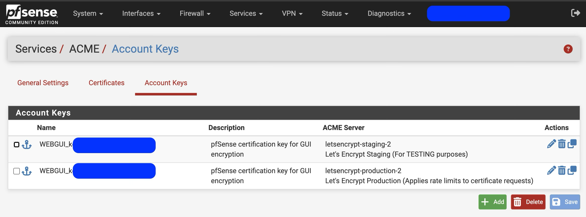
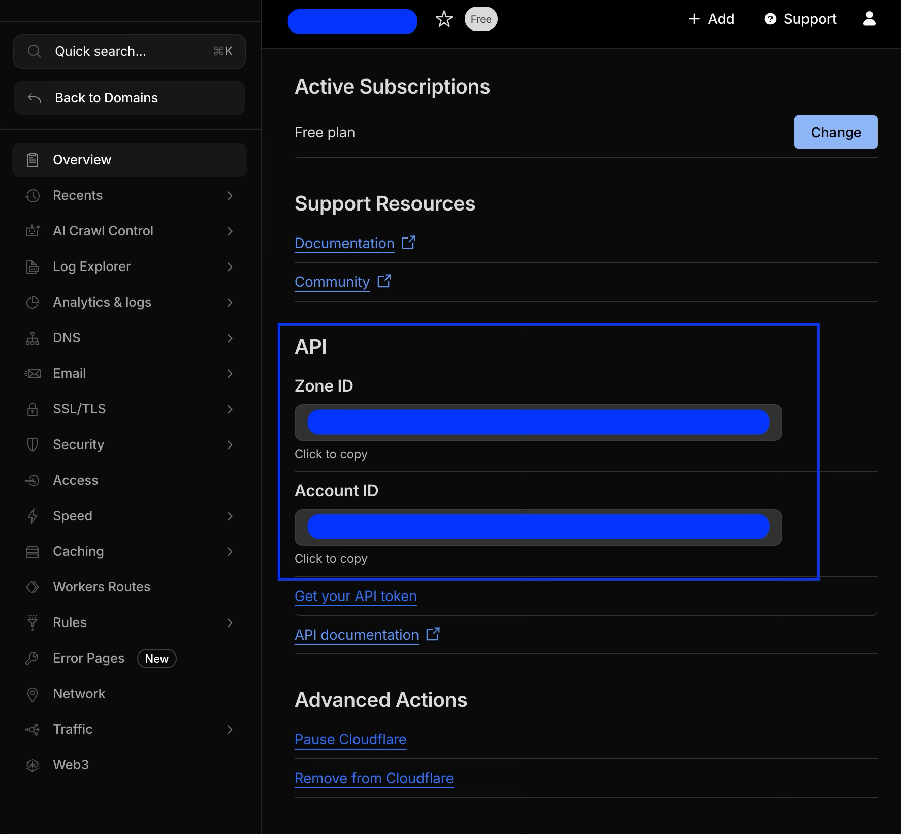
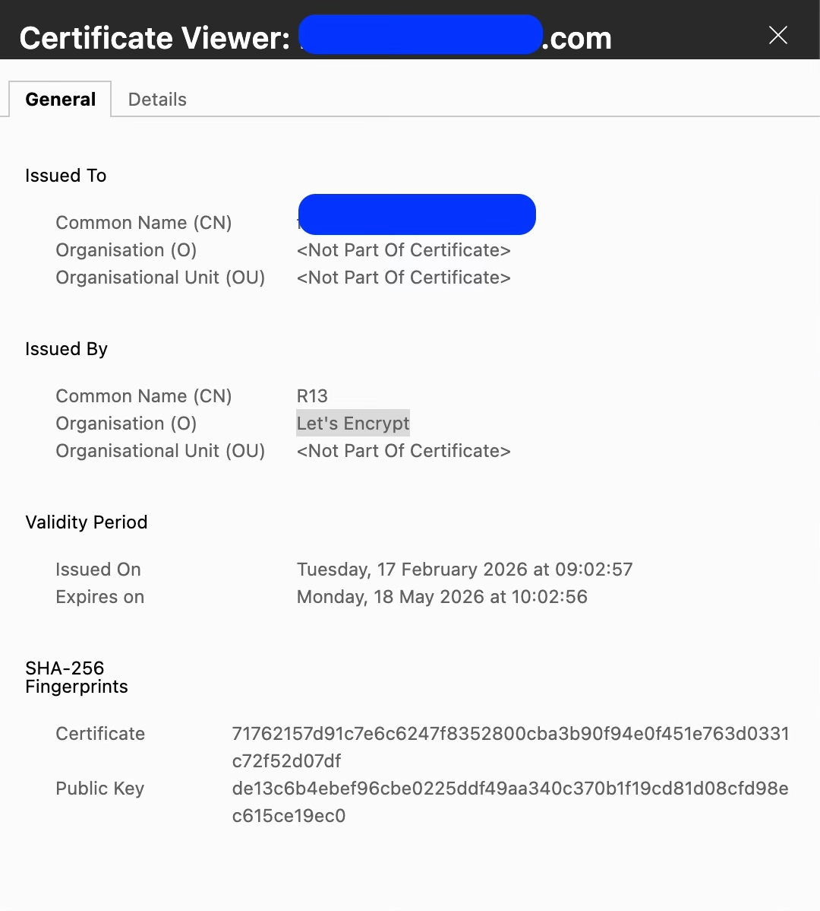

# pfSense ACME + Cloudflare + Let’s Encrypt

HTTPS certificate issuance for **pfSense** using **Let’s
Encrypt DNS challenge via Cloudflare**.

---

## Overview

This repository explains how to:

- Use the ACME package on pfSense
- Issue Let’s Encrypt certificates using Cloudflare DNS validation
- Test with staging before production
- Assign certificates to the pfSense WebGUI
- Troubleshoot common DNS/API issues

---

## Requirements

- pfSense firewall
- Domain managed in Cloudflare
- Cloudflare API Token (DNS Edit permissions)
- Internet connectivity from firewall

---

## Setup Checklist

1. Create local name resolution pointing to firewall
2. ACME package in pfSense
    a. Create ACME account keys
    b. Cloudflare API Token Setup
    c. Cloudflare API Token
    d. Add Certificate
3. Assign certificate to WebGUI
4. Verify HTTPS access

---

## 1. Create local name resolution pointing to firewall

(Linux client) `echo "pfSenseIP pfSenseName" | sudo tee -a /etc/hosts`

---

## 2. ACME Package

System → Package Manager → Available Packages → Install **ACME**

---

### 2.a Create ACME Account Keys

Services → ACME → Account Keys

- Create staging and production accounts, these account keys allow the firewall to identify itself (a user level) when working with Let’s Encrypt.

---

### 2.b Cloudflare API Token Setup

1. Log into Cloudflare
2. Go to API Tokens
3. Create token using template:
    - Zone → DNS → Edit
    - Zone → Zone → Read
4. Scope to specific zone (yourdomain.com)

⚠ Only use CF_Token when using API tokens.

---

### 2.c Cloudflare API Token Setup

1. Copy token available in the general information of the public domain into pfSense ACME DNS-Cloudflare settings

---

### 2.d Add Certificate

Services → ACME → Certificates

- Add
    - Specify **General**: name, description, private key, ACME Account Key
    - Specify in **ACME Server / Certificate Authority** the ACME Account Key (staging key/account)
    - Specify **Validation**: SAN (FQDN) and the Validation Method (Cloudflare). Then input Token, Token Zone ID, Token Account ID and Global Email.
- Enable "/etc/rc.restart_webgui” shell command in **Post-Renew Actions**
- Once the certificate has been saved, click on “issue/renew”.
    - The GUI will display the certificate validity dates. Once done the certificate account key can be changed to the production account key.

---

## 3. Assign Certificate to pfSense GUI

System → Advanced → Admin Access (webConfigurator)

- Protocol: HTTPS
- Port: 443
- SSL Certificate: Select newly issued ACME certificate

Save and apply.

---

### 4. Verification

Visit (open from a new browser session):

https://fw1.yourdomain.com

You should see a valid Let’s Encrypt certificate.

- Assign production account once staging has been validated

---

## Troubleshooting

**Invalid items to check:** FQDN, connectivity, Incorrect Cloudflare zone - Wrong API token
permissions

**TXT record not created** - Token missing DNS edit permission - DNS
propagation delay

Check logs: /tmp/acme/…/acme_issuecert.log

---

## Security Notes

- Use API Tokens (not Global API Key)
- Rotate tokens periodically
- Do not commit secrets to GitHub

---

## License

MIT License
